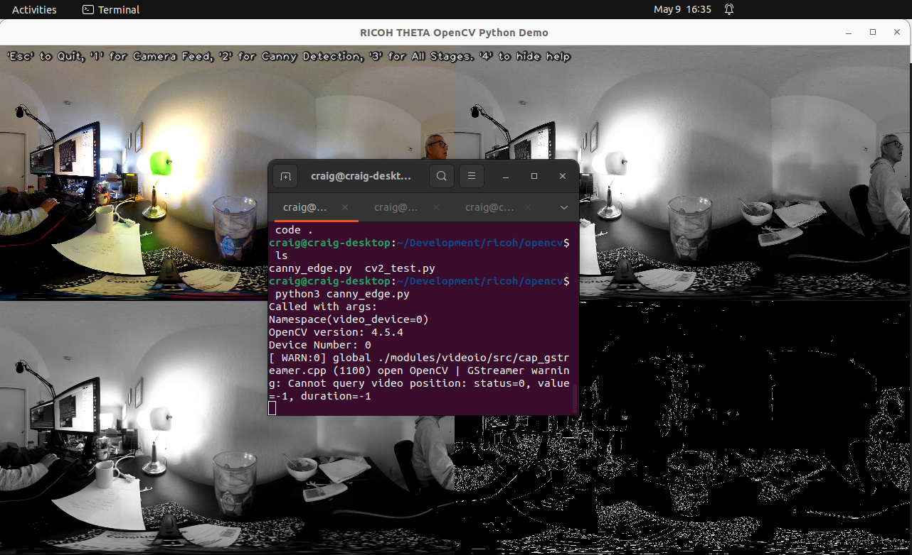
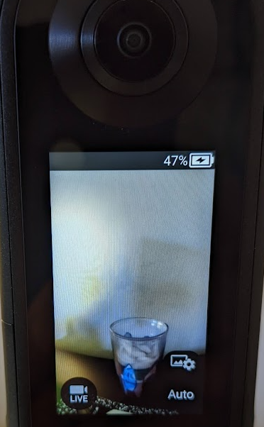
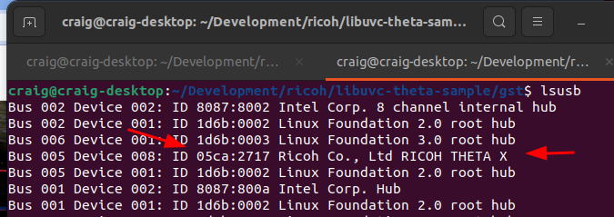
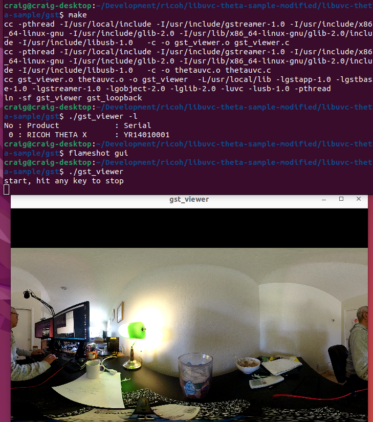
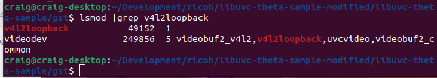

# libuvc-theta-sample

See this site for more information on usage.

https://theta360.guide/special/linuxstreaming/


## prerequisites

You must install a patched version of libuvc.
Get and install [libuvc-theta](https://github.com/ricohapi/libuvc-theta)

To install libuvc-theta on Ubuntu 20.04, you need libusb-1.0-0-dev and optionally libusb-1.0-0-dev

libuvc will install in `/usr/local/lib/`

```text
-- Installing: /usr/local/lib/libuvc.so.0.0.6
-- Installing: /usr/local/lib/libuvc.so.0
-- Installing: /usr/local/lib/libuvc.so
-- Installing: /usr/local/include/libuvc/libuvc.h
-- Installing: /usr/local/include/libuvc/libuvc_config.h
-- Installing: /usr/local/lib/libuvc.a
```

After you install `libuvc-theta`, you should run ldconfig.

```
sudo /sbin/ldconfig
```

ldconfig normally runs when you reboot your computer.

## gstreamer

I'm still figuring out what is needed to install gstreamer.  The following command will install everything.

```
sudo apt-get install libgstreamer1.0-0 gstreamer1.0-plugins-base gstreamer1.0-plugins-good gstreamer1.0-plugins-bad gstreamer1.0-plugins-ugly gstreamer1.0-libav gstreamer1.0-doc gstreamer1.0-tools gstreamer1.0-x gstreamer1.0-alsa gstreamer1.0-gl gstreamer1.0-gtk3 gstreamer1.0-qt5 gstreamer1.0-pulseaudio libgstreamer-plugins-base1.0-dev
```


## gst/gst_viewer
Decode and display sample using gstreamer. You may need gstreamer1.0 develpment packages to build and run.

To display RICOH THETA cameras connected to device.

With THETA X

```text
./gst_viewer -l
No : Product            : Serial    
 0 : RICOH THETA X      : YR14010001

```

With THETA Z1 in live streaming mode.

```text
$ ./gst_viewer -l
No : Product            : Serial    
 0 : RICOH THETA Z1     : 10010104  

```

## gst/gst_loopback
Feed decoded video to the v4l2loopback device so that v4l2-based application can use THETA video without modification.

CAUTION: gst_loopback may not run on all platforms, as decoder to v4l2loopback pipeline configuration is platform dependent,

### load v4l2loopback

```
 # modprobe v4l2loopback
```

### verify v4l2loopback is loaded

```
$ lsmod
Module                  Size  Used by
uvcvideo               88565  0
bnep                   16562  2
zram                   26166  4
overlay                48691  0
spidev                 13282  0
v4l2loopback           37383  0
```

check for dummy video device.

```
$ v4l2-ctl --info
Driver Info (not using libv4l2):
	Driver name   : v4l2 loopback
	Card type     : Dummy video device (0x0000)
	Bus info      : platform:v4l2loopback-000
	Driver version: 4.9.140
	Capabilities  : 0x85208003
```

start gst_loopback
You must have v4l2loopback installed

```
$ ./gst_loopback 
start, hit any key to stop
Opening in BLOCKING MODE 
NvMMLiteOpen : Block : BlockType = 261 
NVMEDIA: Reading vendor.tegra.display-size : status: 6 
NvMMLiteBlockCreate : Block : BlockType = 261 
```



Check video resolution.

```
$ v4l2-ctl --list-formats-ext
ioctl: VIDIOC_ENUM_FMT
	Index       : 0
	Type        : Video Capture
	Pixel Format: 'YU12'
	Name        : Planar YUV 4:2:0
		Size: Discrete 1920x960
			Interval: Discrete 0.033s (30.000 fps)
```

### Specify resolution

```
$ ./gst_loopback --format 4K
start, hit any key to stop
```

#### Check resolution

```
$ v4l2-ctl --device /dev/video2 --list-formats-ext
ioctl: VIDIOC_ENUM_FMT
	Type: Video Capture

	[0]: 'YU12' (Planar YUV 4:2:0)
		Size: Discrete 3840x1920
			Interval: Discrete 0.033s (30.000 fps)
```

### Set Format to 2K

```
$ ./gst_loopback --format 2K
start, hit any key to stop
```
confirm

```
$ v4l2-ctl --device /dev/video2 --list-formats-ext
ioctl: VIDIOC_ENUM_FMT
	Type: Video Capture

	[0]: 'YU12' (Planar YUV 4:2:0)
		Size: Discrete 1920x960
			Interval: Discrete 0.033s (30.000 fps)
```
## Troubleshooting

Verify camera has live icon.



Verify that lsusb sees camera with correct device number.



Output of make.



### loopback

Verify that v4l2loopback is loaded into the kernel.



